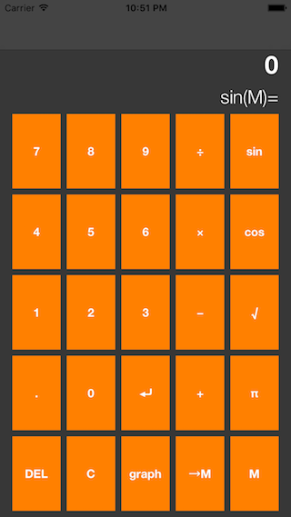

# Calculator 
A simple postfixed calculator built as a project given from the Standford iOS Development Course.

# Topics Learned From The Assignment
- Optionals
- Closures Syntax
- Enum Syntax
- Switch Syntax
- Dictionary Syntax
- Tuples Syntax
- Autolayout
- UILabel 
- Outlets
- UIViewController
- Class Syntax
- Computed & Stored Properties
